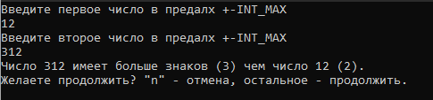
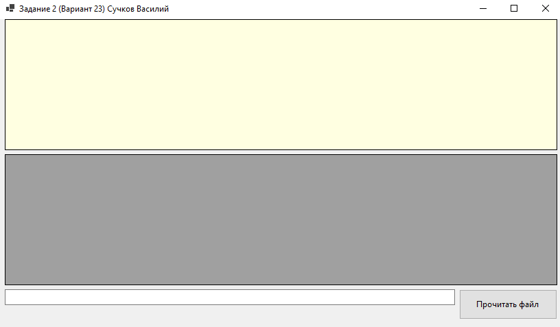
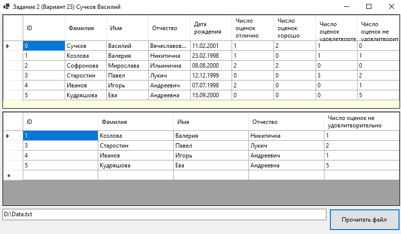

## Лабораторная работа № 1 "Организация информационно технического проекта"
### Вариант 23 (задания 6,6). Работу выполнил студент группы ББМО-01-22 Сучков Василий
### Задание 1 - Определение числа с бОльшим количеством цифр
Для реализации программы использовалось консольное приложение Windows, написанное на языке `C++`.
### Usage
После запуска `Task_1_6_Suchkov.exe` файла появится консольный интерфейс программы:

<p align="center">
  
</p>

**Введите два числа, разделив их `Enter`**

**Для повторного запуска, после определения бОльшего числа, введите что угодно, затем нажмите `Enter`**

**Введите `n` для выхода.**

**Важно! число, которое вы вводите, должно быть _числом_ в формате INT, в противном случае - программа выдаст ошибку**
### Info
Программа использует stoi для преобразования строки в число
```cpp
std::cout << "Введите первое число в предалх +-INT_MAX\n";
std::cin >> first;
try {
    first_value = stoi(first);
}
catch (...)
{
    std::cout << "Ошибка при вводе числа! Попробуйте еще раз.\n";
    return ;
}
```
Поэтому программа поддерживает формат входного числа:
* `1234[some_text]`
* `00001234`
*  `+1234`
*  `12.34`

Но будет выдавать ошибки при переполнении INT! 

В случае возникновения ошибок или успешного выполнения, программа предложит продолжить использование.

### Задание 2 - Вывод ФИО студентов, имющих задолженности по экзаменам
Для реализации программы использовалось приложение с интерфейсом `WinodwsForms`, написанное на языке `C#`.
### Usage
Программа имеет оконный интерфейс с двумя таблицами, полем для ввода пути до файла с имходными данными и кнопкой запуска.

<p align="center">
  
</p>

Программа читает текстовый файл в поиске входной информации.

**Важно!**
```
Формат записи должен быть: 
{ 
Фамилия 
Имя 
Отчество 
Дата рождения 
[ 
Название предмета 
Дата экзамена 
Фамилия преподавателя 
Имя преподавателя 
Отчество преподавателя 
Оценка 
] 
} 
```
* Число открытых скобок всегда должно быть равно числу закрытых скобок
* Запись должна содержать все строки из примера
* Число предметов в скобках [] должно быть от 3 до 5

**Если эти условия не выполнятся - программа выдаст ошибку**

Для обработки данных, введите абсолютный путь до файла и нажмите кнопку "Прочитать файл":


<p align="center">
  
</p>

В верхней таблице отображается сводка по успеваемости студентов.

В нижней таблице отображается информация о студентах с задолженностями по экзаменам.
### Info
С пустым полем пути к файлу программа обрабатывает файл `Data.txt`, находящийся в папке с исполняемым `Task_2_6_Suchkov.exe`.
```cpp
path = Path_box.Text;
if (String.IsNullOrEmpty(path))
    path = "./Data.txt";
```
Программа проверяет структуру файла:
```cpp
private int file_checker(string path)
        {
            int counter_11 = 0;
            int counter_12 = 0;
            int counter_21 = 0;
            int counter_22 = 0;
            int subj_counter = 0;
            string[] file = File.ReadAllLines(path);
            for (int i = 0; i < file.Length; i++)
            {
                if (file[i] == "{")
                {
                    subj_counter = 0;
                    counter_11++;
                    if (students_checker(file, i) == 0)
                        return (0);
                }
                if (file[i] == "}")
                {
                    if (subj_counter < 3 || subj_counter > 5)
                        return (0);
                    counter_12++;
                }
                if (file[i] == "[")
                {
                    subj_counter++;
                    counter_21++;
                    if (subject_checker(file, i) == 0)
                        return (0);
                }
                if (file[i] == "]")
                    counter_22++;
            }
            if (counter_11 != counter_12 || counter_21 != counter_22)
                return (0);
            return (1);
        }
```
Программа содержит классы-контейнеры для хранения информации о студентах и их предметах:
```cpp
public class Subject
    {
        public string subj;
        public string exam_date;
        public string t_name;
        public string t_surname;
        public string t_patronymic;
        public int mark;
    }
    
public class Data
    {
        public int subj_size;
        public string name;
        public string surname;
        public string patronymic;
        public string date_of_birth;
        public Subject[] subjs;
    }
```
Из парсера файла можно получить deep copy контейнеров вызовом функции `get_students`. Класс-парсер Students имеет только перегруженный конструктор, принимающий путь до файла с данными.
```cpp
 Students st = new Students(path);
 Data[] students = st.get_students();
```